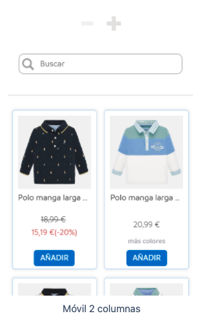

# Technical test for Mayoral

Technical test for Mayoral, with the following conditions:

|              Desktop              |             Mobile              |
| :-------------------------------: | :-----------------------------: |
|  |  |

Layout the attached images and take into account the different cuts on mobile and desktop. The test should be uploaded to a GitHub repository.

Required Technologies/Libraries:

- React
- Typescript
- Next.js

Functionality to implement:

- Separate into components in an optimally organized way.
- The view should resemble as close as possible to the attached photos
- Implement product search by name
- Consume a JSON with product data (local or external JSON)
- Change the view with the icons indicated in the photo:
  - Desktop from 4 to 3 elements
  - Mobile from 3 to 2 elements
- Implement logic and design of a "sort" component (ascending and descending price)
- Create the unit tests as you see fit

## Getting Started 🚀

To launch the project, simply do npm install. 

Then use the following commands:
    - npm run dev: Launches the project in a development version.
    - npm run build: Creates a build for production.
    - npm run start: Launches the production build.
    - npm run lint: Launches the linter to check for possible errors.
    - npm test:watch: Runs jest for continuous testing.
    - npm test: Launches Jest only once for testing.

### Work done 📋

The technologies required for the project have been used. React, Typescript and Next.js, plus Jest to launch some tests. 

### Components and framework 🔧

For the components and structure, we have sought to componentize in folders. All the components are typed and we have tried to make them as reusable as possible.
to be as reusable as possible. To do this, I have left for props some values such as the data that is passed to each component or
the event functions, so that each page is the one that decides which values or events to pass. 

I have done some tests with Jest for some components, checking if they render the expected result.

## Tools ⚙️

For generic functions, I have created a tools file, where we find functions to calculate discounts, perform searches, filter...etc.
I have also created tests for the tools, so that the tests check if the functions return the required values.

### Styles 🔩

For CSS styling, SCSS has been used, creating nested structures and global variables shared between components.

### API ⌨️

For the API call, it has been separated in a separate file, in the services folder. Both the JSON with the data
as well as the images of the T-shirts are uploaded on a private server, to simulate as much as possible a real call.
Since there was only one call, we simply used fecth. 

## Interfaces 📦

The interfaces and enumerations used are in the models folder.

## Tweaks to the configuration 🛠️

I have made some tweaks in the configuration files, for example in jest.config.js due to problems when launching tests.

## To conclude 🎁

It has been tried to keep as much as possible the styles. The images used are from Mayoral's own web site, but they are not the same as the ones
the same ones that appear in the example. 

